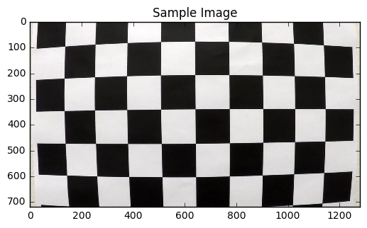
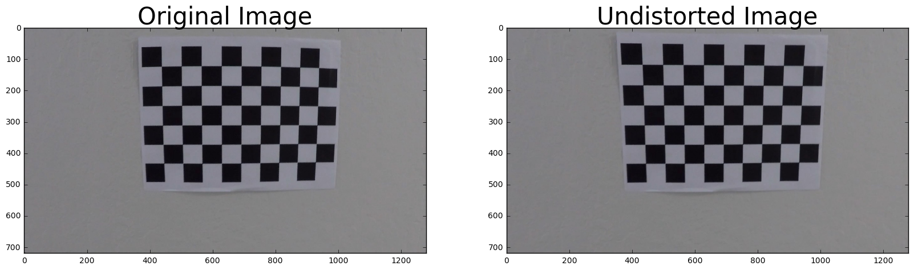

# Advanced Lane Finding Project
In this project, we will build a pipeline using distortion correction, image rectification, color transforms, and gradient thresholding to identify lane lines and their curvature in a video.

The goals / steps of this project are the following:

* Compute the camera calibration matrix and distortion coefficients given a set of chessboard images.
* Apply a distortion correction to raw images.
* Use color transforms, gradients, etc., to create a thresholded binary image.
* Apply a perspective transform to rectify binary image ("birds-eye view").
* Detect lane pixels and fit to find the lane boundary.
* Determine the curvature of the lane and vehicle position with respect to center.
* Warp the detected lane boundaries back onto the original image.
* Output visual display of the lane boundaries and numerical estimation of lane curvature and vehicle position.

## Camera Calibration Matrix and Distortion Coefficients

### process_image function

* Undistort the image
* Define the souce and destination points to get a warped image
* get the binary image for yellow pixels in the warped image
* get the binary image for white pixels in the warped image
* create a binary image containing yellow and white pixels found earlier
* divide the image in two parts vertically to get the x,y axis for points representing left and right lanes
* adding the x,y points to the lanes to extend the lanes to top and bottom of the binary image
* fit the points to get lanes including curvedd ones
* calculate the curvature of left and right lanes
* calculate the lane deviation from the center
* draw the lanes on the warped image
* unwarped the warped image to get the image with lanes drawn on it
* add the curvature and lane deviation information to the lanes image
* return the intermediate and final results to show later

* pipeline is comparatively fast, less computations and good results even on challenge video
* Did not use gradient thresholding as those were contributing noise and were resulting in doing extra calculations like removing noise, histogram calculations   

## Test Images

## Videos

### process_video function
* declare the global variables to store lanes from previous frames
* Undistort the image
* Define the souce and destination points to get a warped image
* get the binary image for yellow pixels in the warped image
* get the binary image for white pixels in the warped image
* create a binary image containing yellow and white pixels found earlier
* intelligently searching the lanes points by divide the image in two parts vertically by getting the information about lanes in previous frames, to get the x,y axis for points representing left and right lanes
* adding the x,y points to the lanes to extend the lanes to top and bottom of the binary image
* fit the points to get lanes including curvedd ones, also giving half weightage to lanes from last frame
* A second order polynomial was fit to each line: f(y) = Ay^2 + By + C As discused in lesson 13 the resulting coeficients have the following meaning:
* A gives the curvature of the lane line
* B gives the heading or direction that the line is pointing
* C gives the position of the line based on how far away it is from the very left of an image (y = 0)
* if the new lanes are significantly different then the lanes from previous frames, lanes from previous frames are used 
* calculate the curvature of left and right lanes
* calculate the lane deviation from the center
* draw the lanes on the warped image
* unwarped the warped image to get the image with lanes drawn on it
* add the curvature and lane deviation information to the lanes image
* save the lanes information for next frames
* return the frame containinginormation about lanes, curvature and vehicle deviatation from center  

* pipeline is comparatively fast, less computations and good results even on challenge video
* Did not use gradient thresholding as those were contributing noise and were resulting in doing extra calculations like removing noise, histogram and slidin window calculations   

Output videos can be found [here](https://github.com/UsmanIjaz/SDC_Advanced_Lane_Lines_Detection/tree/master/output_videos)

## Learning
* Learnt a lot about opencv through lesson and working on the project.
* I feel that my pipeline is a bit faster than the other possible solutions with comparatively good results. 
* Met the project requirement as I am using color transform in two different ways.
* Applied gradient thresholding but did not get good results out of that as it resulted in noise which in turn demands noise removal using techniques like histogram and sliding window calculations. My results prove that good results can be achieved without gradient thresholding. 
* The algorithm did not work well on herder challenge video and for that I think I will need to try deep learning
* The main problem in that case is bigger curves and an intelligent way of defining source and destination points for warping will be helpful. 
